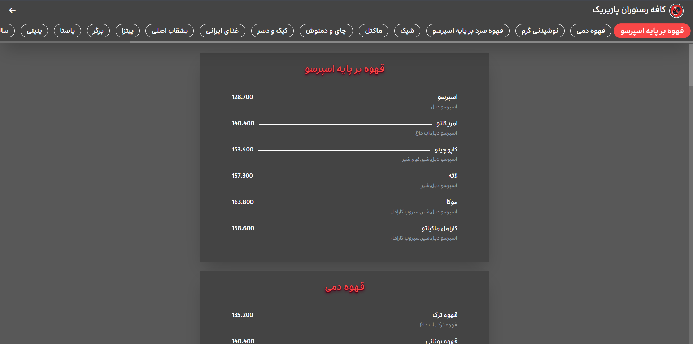

# 🍽️ Pazirik Restaurant - Dynamic Menu

A fully responsive restaurant menu website with advanced admin panel for dynamic product management.

## 🌟 Live Demo
**Website URL:** [https://rogitxtdff.github.io/Pazirik-menu/](https://rogitxtdff.github.io/Pazirik-menu/)  
**Login Panel:** [https://rogitxtdff.github.io/Pazirik-menu/login.html](https://rogitxtdff.github.io/Pazirik-menu/login.html)

---

## ⚠️ Important Note for Iranian Users
**Due to using Google Firebase services, you need to `use VPN/Filter` Shakan to access the website properly.**

---

## 🚀 Technologies Used

### Frontend
- **HTML5** - Semantic and modern structure
- **CSS3** - Advanced styling with animations
- **Tailwind CSS** - Utility-first CSS framework
- **JavaScript (ES6+)** - Modern JavaScript features
- **Font Awesome 6** - Beautiful icons
- **SweetAlert2** - Beautiful alerts and modals

### Backend & Database
- **Firebase Firestore** - NoSQL real-time database
- **Firebase Authentication** - Secure user management
- **Firebase Storage** - Image storage and hosting
- **RESTful API** - Clean API architecture

### Features
- **Full CRUD Operations** - Create, Read, Update, Delete products
- **Responsive Design** - Mobile-first approach
- **Professional UI/UX** - Modern and user-friendly interface
- **Category Management** - Organized menu structure
- **Real-time Updates** - Instant changes without refresh
- **Search & Filter** - Easy product discovery

---

## 🔐 Admin Access Credentials

### Login Information:
- **Email:** `admin@pazirik.com`
- **Password:** `PazirikAdmin2025`

*🔒 Note: These credentials are for demo purposes. Change them in production.*

